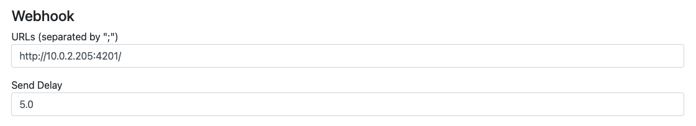

# Configuring your scanner

You will need to set your scanner up to send webhooks to Poracle.

## MAD

1. Alter your config.ini file to send webhooks to the endpoint that you have configured for poracle

```
# webhook
######################
webhook                     # Activate support for webhook
webhook_url: http://127.0.0.1:4201    # webhook endpoint (multiple seperated by comma)
#
```

2. Alter your config.ini file to send quests in poracle format - this format is also compatible with Pokealarm
and other common tools, so there should be no problem setting this.

```shell
quest_webhook_flavor: poracle      # Mode for quest webhooks (default or poracle)
```

3. You will see discussion of the poraclePvpHelper - which sends additional details in the webhooks for tracking
of PVP suitable Pokemon.  I suggest that this is configured later when everything is working, but when you
   do you will want to restrict MAD to sending non-Pokemon hooks - like this:

```
# webhook
######################
webhook                     # Activate support for webhook
webhook_url: [raid gym weather pokestop quest]http://127.0.0.1:4201             # webhook endpoint (multiple seperated by comma)
#
```

## RDM

1. Under dashboard/Settings there are Webhook settings.  Configure appropriately (note that if you are running
   RDM inside docker then this will need to be an address that will punch through to Poracle)
   
