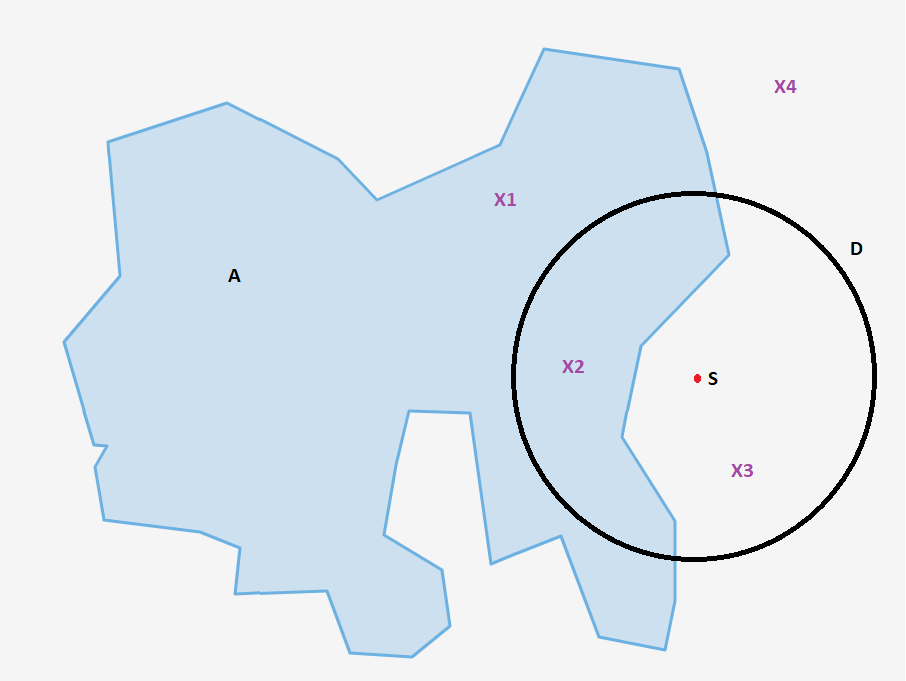

# Filter-Optionen

## Basics
**`/stop` & `/start`**  
Beim erstmaligen Benutzen eines Bots muss dieser einmalig gestartet werden. Sollte man den Bot zu einem bestimmten Zeitpunkt stoppen und neustarten wollen, kann dies über "/stop" und "/start" durchgeführt werden.

**`/location`**  
Mit dem Location Befehl kann ein persönlicher Standort gewählt werden. Der Befehl kann durch eine Koordinaten-Angabe oder durch eine ausgeschriebene Adresse angegeben werden. Ob der Standort korrekt übernommen wurde, kann durch die Anzeige in "/tracked" überprüft werden. Der Standort wird anschließend für die Filteroption mit `Distanz` verwendet.

**`/area add` & `/area remove` & `/area list`**  
Alternativ zum persönlichen Standort können auch hinterlegte Areas angewählt werden. Welche Areas für deinen Bot zur Verfügung stehen zeigt der Befehl `/area list`. Die dort angegebenen Areas können dann mit `/area add *name*` hinzugefügt und mit `/area remove *name*` entfernt werden.

**`/tracked`**  
gibt zu jedem Zeitpunkt die aktuellen Filtereinstellungen aus. Es erfolgen Angaben zum Standort, zu den gewählten Areas und zu allen Filtern die sich auf [Pokémon](#pokémon) bis [Rocket/Invasion](#rocketinvasion) beziehen.

## Pokémon
Nachfolgend werden alle Filteroptionen für das tracken von Pokémon ausgeführt. Jeder Befehl muss sich dabei auf mindestens ein Pokémon beziehen, alle anderen Komponenten sind jedoch nach Bedarf wählbar oder wegzulassen.

**`/track pikachu d1000 iv20 maxiv30 wp400 maxwp500 level6 maxlevel7 atk8 maxatk9 def8 maxdef9 sta8 maxsta9 t10 male/female/genderless`**

**`/track`**  
alle Befehle um Pokémon-Meldungen einzustellen beginnen mit "/track".
Mit "/untrack [...]" können entsprechende Befehle wieder entfernt werden. Dabei können nur alle Track Befehle zu einem Pokémon oder zu allen Pokémon gleichzeitig entfernt werden.

**`pikachu`**  
an dieser Stelle wird ausgewählt, auf welches Pokémon sich der Befehl beziehen soll. Möglich sind dabei die Nennung von einem oder mehreren Pokémon nach Dexnummern oder Namen (Englisch und Deutsch möglich, getrennt durch ein Leerzeichen), das tracken aller Pokémon durch “everything” oder das angeben einer gesamten Generation mit “genX” 

**`d1000`**  
Ob eine Pokémon-Meldung für den User interessant ist, kann auch von der Geo-Location abhängig gemacht werden. Wurden wie in den [Basics](#basics) beschrieben eine oder mehrere Areas gewählt, werden alle Pokémon innerhalb der Area mit den entsprechenden Stats gemeldet. Alternativ dazu steht die Angabe eines Persönlichen Standorts. Die Filteroption "dXXXX" bezieht sich dabei auf diesen Standort und gibt die maximale Entfernung von diesem Standort in Metern an. Area und Standort können auch gleichzeitig verwendet werden, bei der Meldung wird sich dabei auf die Vereinigung der beiden bezogen (sowohl das gesamte Gebiet der Area, als auch der gesamte Radius des Standorts).

Hat ein User den Standort S angegeben, nutzt Distanz D und hat die Area A hinzugefügt, erhält er Infos über X1 als teil der Area A, Infos über X3 weil es innerhalb des Distanz-Radiuses befindet, und Infos zu X2 sowohl durch Area A als auch durch die Distanz. Aber keine Infos zu X4, da dieser Punkt sowohl außerhalb der Area als auch außerhalb der Distanz liegt. 

**`iv20 maxiv30`**  
"ivX" gibt das Minimum des IV-Werts an, welches das Pokémon haben soll, um gemeldet zu werden. Wird kein "ivX" angegeben, wird automatisch iv0 als unteres Limit gesetzt.
"maxivX" gibt das Maximum des IV-Werts an, welches das Pokémon haben soll, um gemeldet zu werden. Wird kein "maxivX" angegeben, wird automatisch iv100 als oberes Limit gesetzt.  

Beispiele:  
**`/track pikachu iv100`** - es werden all Pikachu gemeldet die 100IV haben.  
**`/track pikachu maxiv0`** - es werden alle Pikachu gemeldet die 0IV haben.   
**`/track pikachu miniv50 maxiv60`** - es werden alle pikachu gemeldet die im IV-bereich zwischen 50% und 60% liegen  

**Hinweis**: Bei der gängigen IV-Angabe werden ganze Zahlen gerundet. Ein Pokémon das mit IV98 klassifiziert wird hat also eigentlich 44 von 45 möglichen IV-Punkten (15atk,15def,15sta) und damit prozentual 97,77%. 
Rein rechnerisch wäre IV97,77 also nicht im IV-Bereich IV98 enthalten. Aber auch Poracle nutzt die gerundeten Werte. zb. 97,77% fällt also in IV98+, 93,33% aber nicht in IV94+.  

**`wp400 maxwp500`**  
"wpX" gibt das Minimum des Wp-Werts an, welches das Pokémon haben soll, um gemeldet zu werden. Wird kein "wpX" angegeben, wird automatisch wp0 als unteres Limit gesetzt.
"maxwpX" gibt das Maximum des Wp-Werts an, welchen das Pokémon haben soll, um gemeldet zu werden. Wird kein "maxwpX" angegeben, wird kein oberes Limit gesetzt.

**`level6 maxlevel7`**  
"levelX" gibt das Minimum des Level-Werts an, welches das Pokémon haben soll, um gemeldet zu werden. Wird kein "levelX" angegeben, wird automatisch level0 als unteres Limit gesetzt.  
"maxlevelX" gibt das Maximum des Level-Werts an, welches das Pokémon haben soll, um gemeldet zu werden. Wird kein "maxlevelX" angegeben, wird kein oberes Limit gesetzt.

**`atk8 maxatk9`**  
"atkX" gibt das Minimum des Angriff-Werts an, welches das Pokémon haben soll, um gemeldet zu werden. Wird kein "atkX" angegeben, wird automatisch atk0 als unteres Limit gesetzt.  
"maxatkX" gibt das Maximum des Angriff-Werts an, welches das Pokémon haben soll, um gemeldet zu werden. Wird kein "maxatkX" angegeben, wird automatisch atk15 als oberes Limit gesetzt.

**`def8 maxdef9`**  
hier gilt selbiges wie für Atk

**`sta8 maxsta9`**  
hier gilt selbiges wie für Atk

**`t10`**  
Gibt die minimale Restzeit an, die eine Meldung haben soll. Manche Pokémon werden erst relativ spät, mit z.B. 2 Minuten Restzeit gemeldet. Da diese unter Umständen nicht mehr erreicht werden können, kann man eine Benachrichtigung dafür direkt deaktivieren.

**`male/female/genderless`**  
Hier kann gezielt nach einer bestimmten Gender-Klassifizierung gefiltert werden. Dies kann z.B. sinnvoll sein, wenn man nach einem Wadribi sucht, welches sich entwickeln lässt. Dementsprechend müsste man nur nach der weiblichen Form suchen.

Als Zusatz zu den Pokémon-Namen kennt Poracle noch diverse Form-Namen, um z.B. nur nach Alola-Pokémon zu suchen. Eine genaue Auflistung findet sich in Punkt [Pokémon-Formen](#besondere-form_namen).

Zu einem Pokémon können mehrere Einträge erzeugt werden.  
Beispielsweise kann mit 2 Befehlen sowohl die Meldung von Pokémon mit maximal 0IV und minimal 100IV eingestellt werden. 

Wichtig: Ob die Angabe eines /track-Befehls wie gewünscht funktioniert hat, lässt sich jederzeit durch den Befehl `**/tracked** prüfen`. Der Bot gibt dann alle Einstellungen an, die er aktuell zum Filtern verwendet. 

## Quest
Alle Quest-Befehle beginnen mit **`/quest`** und können mit **`/quest remove`** wieder entfernt werden. Quest-Befehle können mit der Distanz-Komponente aus [Pokémon](#pokémon) arbeiten.

### Pokémon
**`/quest Pikachu`** - meldet alle Quests die Pikachu als Belohnung haben.  
**`/quest all pokemon`** - meldet alle Quests die ein Pokémon als Belohnung haben.  
**`/quest gen1`** - meldet alle Quests die ein Pokémon der ersten Generation als Belohnung haben.

### Items  
**`/quest all items`** - meldet alle Quests die Items als Belohnung haben.  
**`/quest item rare candy`** - meldet alle Quests die Sonderbonbons als Belohnung haben.   

| Schreibweise im Befehl | Dt. Itemname |   
|:-----------|:-------------|  
|"Poke Ball",|  Pokeball |  
|"Great Ball",  | Superball |  
|"Ultra Ball",  | Hyperball |  
|"Master Ball",  | Meisterball |  
|"Premier Ball",  | Premierball |  
|"Potion",  | Trank |  
|"Super Potion",  | Supertrank |  
|"Hyper Potion",  | Hypertrank |  
|"Max Potion",  | Top-Trank |  
|"Revive",  | Beleber |  
|"Max Revive",  | Top-Beleber |  
|"Lucky Egg",  | Glücks-Ei |  
|"Incense Ordinary",  | Rauch |  
|"Incense Spicy",  | n/a |  
|"Incense Cool",  | n/a |  
|"Incense Floral",  | n/a |  
|"Troy Disk",  | Lockmodul |  
|"Troy Glacial Disk",  | Gletscher-Lockmodul |  
|"Troy Mossy Disk",  | Moos-Lockmodul |  
|"Troy Magnetic Disk", | Magnet-Lockmodul |  
|"X Attack",  | X Attack |  
|"X Defense",  | X Defense |  
|"X Miracle",  | X Miracle |  
|"Razz Berry",  | Himmihbeere |  
|"Bluk Berry",  | n/a |  
|"Nanab Berry",  | Nanabbeere |  
|"Wepar Berry",  | n/a |  
|"Pinap Berry",  | Sananabeere |  
|"Golden Razz Berry",  | Goldene Himmihbeere |  
|"Golden Nanab Berry",  | Goldene Nanabbeere |  
|"Silver Pinap Berry",  | Silberne Sananabeere |  
|"Special Camera",  | Kamera |  
|"Incubator Basic Unlimited",  | Brutmaschine |  
|"Incubator Basic",  | Brutmaschine |  
|"Incubator Super",  | Super-Brutmaschiene |  
|"Pokemon Storage Upgrade",  | Pokemon Storage Upgrade |  
|"Item Storage Upgrade",  | Item Storage Upgrade |  
|"Sun Stone",  | Sonnenstein |  
|"Kings Rock",  | Kingstein |  
|"Metal Coat",  | Metalmantel |  
|"Dragon Scale",  | Drachenhaut |  
|"Up Grade",  | Up-Grade |  
|"Sinnoh Stone",  | Sinnoh-Stein |  
|"Unova Stone",  | Einall-Stein |  
|"Fast TM",  | Sofort TM |  
|"Charged TM",  | Lade TM |  
|"Rare Candy",  | Sonderbonbon |  
|"Free Raid Ticket",  | Raid Pass |  
|"Paid Raid Ticket",  | Paid Raid Pass |  
|"Legendary Raid Ticket", | EX Raid Pass |  
|"Star Piece",  | Sternenstück |  
|"Friend Gift Box"  | Geschenk |  

**Hinweis**: Quest-Items werden nur im Englischen unterstützt. Zudem hat Poracle alle aktuell in Spieldatein vorhandenen Items zur Auswahl, dies heißt aber nicht, dass sie auch aus Feldforschungen oder überhaupt im Spiel erhältlich sein müssen.

### Sternenstaub
**`/quest stardust`** - alle Quest die Sternenstaub als Belohnung geben  
**`/quest stardust500`** - Alle Quest die mindestens 500 Sternenstaub als Belohnung geben.  

## Raid
Raids werden in zwei verschiedenen Stufen gemeldet. Es besteht zum einen die Möglichkeit sich über ein erschienenes Raid-Ei und anschließend über einen geschlüpften Raidboss informieren zulassen.  
Für erschienene Eier beginnen die Befehle mit */egg*, für Raidboss mit */raid*.
Entsprechend ist es nur mit */raid*-Befehlen möglich explizite Pokémon melden zu lassen.  
**`/raid Relaxo`** - meldet alle Relaxo-Raids.  
**`/raid gen1`** - meldet alle Raids der ersten Generation(Kanto).

Darüber hinaus lassen sich sowohl für */raid*-, als auch für */egg*-Befehle folgende Filter-Optionen anwenden (diese lassen sich überwiegend frei miteinander kombinieren):
**`/raid(/egg) level2`** - meldet alle Raids bzw Eier der Raidstufe 2 (dieser kann nicht mit einer expliziten Pokémon-wahl kombiniert werden!)
**`/raid(/egg) d1000`** - auch Raids können abhängig vom eigenen Standort gefiltert werden
**`/raid(/egg) ex`** - es werden nur Raids an Arenen gemeldet die aktuell den EX-Raid-Tag haben
**`/raid(/egg) instinct/valor/mystic/harmony`** - Es werden nur Raids gemeldet die unter der entsprechenden Kontrolle des gewählten Teams stehen.
**`/raid(/egg) everything`** - es werden alle Raids/Eier gemeldet

**`/egg remove`** bzw **`/raid remove`** entfernt alle Filter zu Raids und Eiern. Es kann sich hierbei auch nur auf einzelne Raidlevel oder Pokémon bezogen werden z.b. **`/raid remove Relaxo`**.

## Rocket/Invasion
Das Scannen von Rocket-Stops passiert aktuell nur Passiv. Das heißt die Pokestops werden nicht aktiv angesprungen sondern nur über das Umgebungsradar wahrgenommen. An jder Stelle, an der ein Scanner also einem beliebigen Job nachgeht, zb. Pokémon-Scan, bekommt er Infos über umliegende Rocket-Stops.
Enthalten sind Infos über den Ort des Rüpels, über den Spruch und über das Geschlecht. Jeder Kombi aus Spruch und Geschlecht ist ein bestimmtes Set an Pokémon zugeordnet. Innerhalb dieses Sets gibt es dann verschiedene Pokémon, die zu einer bestimmten Quote als Rocket-Belohnung encountert werden können.
Da sich die Worker aber zu keinem Zeitpunkt aktiv in einen Rocket-Kampf begeben, wissen sie nicht exakt, welches Pokémon  als Belohnung herauskommen wird. Entsprechend kann in Poracle auch nicht nach bestimmten Pokémon gefiltert werden, sondern nur nach Typ und Geschlecht.

Rocket-Befehle starten alle mit */invasion*.  
Mit **`/invasion remove`** können alle Filtereinstellungen zu Rockets wieder entfernt werden.  
**`/invasion`** - Alle Rocket-Stops werden gemeldet.  
Auch /Invasion-Befehle können sowohl mit Areas als auch mit Distanz(d) arbeiten.  
Darüber hinaus kann mit allen 16 im Spiel verfügbaren Typen (englische Namen) und nach dem Geschlecht gefiltert werden.

| Schreibweise im Befehl | Bedeutung/Ergebnis |   
| :-----------|:-------------|  
|"normal"| Tracked Rockets mit der Möglichkeit auf ein Pokémon vom Type Normal  |  
|"fire"| Tracked Rockets mit der Möglichkeit auf ein Pokémon vom Type Feuer  | 
|"fighting"| Tracked Rockets mit der Möglichkeit auf ein Pokémon vom Type Kampf | 
|"water"| Tracked Rockets mit der Möglichkeit auf ein Pokémon vom Type Wasser | 
|"flying"| Tracked Rockets mit der Möglichkeit auf ein Pokémon vom Type Flug | 
|"grass"| Tracked Rockets mit der Möglichkeit auf ein Pokémon vom Type Pflanze | 
|"poison"| Tracked Rockets mit der Möglichkeit auf ein Pokémon vom Type Gift | 
|"electric"| Tracked Rockets mit der Möglichkeit auf ein Pokémon vom Type Elektro | 
|"ground"| Tracked Rockets mit der Möglichkeit auf ein Pokémon vom Type Boden | 
|"psychic"| Tracked Rockets mit der Möglichkeit auf ein Pokémon vom Type Psycho | 
|"rock"| Tracked Rockets mit der Möglichkeit auf ein Pokémon vom Type Gestein | 
|"ice"| Tracked Rockets mit der Möglichkeit auf ein Pokémon vom Type Eis | 
|"bug"| Tracked Rockets mit der Möglichkeit auf ein Pokémon vom Type Käfer | 
|"dragon"| Tracked Rockets mit der Möglichkeit auf ein Pokémon vom Type Drache | 
|"ghost"| Tracked Rockets mit der Möglichkeit auf ein Pokémon vom Type Geist | 
|"dark"| Tracked Rockets mit der Möglichkeit auf ein Pokémon vom Type Unlicht | 
|"steel"| Tracked Rockets mit der Möglichkeit auf ein Pokémon vom Type Stahl | 
|"fairy"| Tracked Rockets mit der Möglichkeit auf ein Pokémon vom Type Fee | 
|"mixed"| Tracked Rockets bei denen der Typ nicht genau festgelegt ist | 
|"male"| Tracked Rockets die Männlich sind  | 
|"female"| Tracked Rockets die Weiblich sind  |   

*Hinweis*: Mehrere Typen/Filter können kombiniert werden. Z.b.: **`/invasion fire water ice male`** - tracked alle männlichen Rockets die entweder ein Feuer-, ein Wasser, oder ein EisPokémon als mögliche Belohnung haben.
